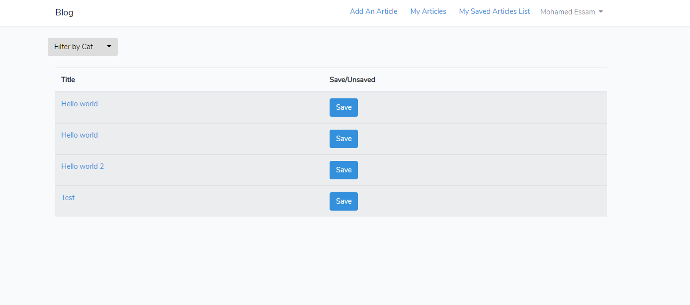

## Install:

- `cd simple-blogging-system`
- `composer install`
- `cp .env-example .env` and open `.env` to change Database env vars
- `php artisan config:cache`
- add new database named 'blog'
- `php artisan migrate`
- Register with any accout of yours and change in DB (select your user in `users` table and replace `is_admin` with 1)
- you can find ready sql file included a test database in root folder which name 'blog.sql'
- `php artisan serve`

## Screens

1- Login Page

2- Home Page includes as listed below:
- Add An Article (shown to Admin)
- My Articles (shown to Admin)
- My Saved Articles (shown to Admin and Registered visitors) in which the user can find links of saved (fav) articles.
- Logout
- Filter By category (cats)
- You may save an article with clicking "Save" Button to your saved Articles

3- Add An Article 

4- Your saved Articles ,you can unsave one

5-Article Page and you can comment

### Any inquiries, Mohamed Essam Fathalla <mohamedessamfathalla@gmail.com> 
